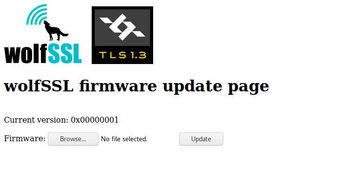
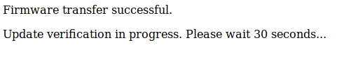

# Freescale-K64F-FreeRTOS-TLS1.3-Update

Firmware update example on FreeRTOS, using a simple HTTPS server with TLS 1.3

This project is meant to demonstrate a firmware upgrade mechanism based on [wolfBoot secure bootloader](https://github.com/wolfssl/wolfBoot), powered by wolfSSL.

The bootloader expect the application to transfer the new firmware, store it in the update partition on the flash memory and trigger an upgrade on the next reboot.

The application in this example uses a HTTPS web form to consent to upload a new firmware image from the host machine. Once the transfer is complete, the target is rebooted into
the bootloader, which validates the new image and copies it to the active boot partition.


## Components
  - Bootloader: [wolfBoot](https://github.com/wolfssl/wolfBoot) by wolfSSL
  - OS:  [freeRTOS](https://www.freertos.org/)
  - TCP/IP stack: PicoTCP
  - Application: Custom HTTPS server over TLS1.3, providing a web form to transfer a new image

## Preparing the initial firmware

The flash memory on the FRDM-K64F is divided as follows:

```
  - 0x000000 - 0x009fff : Bootloader partition for wolfBoot
  - 0x00a000 - 0x083fff : Active (boot) partition
  - 0x084000 - 0x0fdfff : Upgrade partition
  - 0x0ff000 - 0x0fffff : Swap sector
```

### Prerequisites

Kinetis SDK `FRDM-K64F` (can be downloaded from NXP website).

### Compiling

The path to the Kinetis SDK directory must be passed to make through the `KINETIS=` variable.

Running `make KINETIS=/path/to/FRDM-K64F` assembles the following images:
  - wolfBoot compiled to run on FRDM-K64F
  - freeRTOS with automatic start-up of the firmware update process, in a signed image that can be verified by wolfBoot during start-up

The image `factory.bin` contains the bootloader and version 1 of the firmware. It can be directly transferred to the FRDM-K64F using OpenSDA functionalities (e.g. copying to the USB storage)

More information about wolfBoot upgrade mechanism can be found in the [wolfBoot](https://github.com/wolfSSL/wolfBoot) repository.

## Firmware update

Connect to the target through the ethernet port using a web browser (default static IP address: https://192.168.178.211). 

A file submission form is shown. Select the version two of the compiled image `image.bin.v2.signed`, created at compile time, and click `Update`.



When the transfer is complete, a confirmation page is shown. A flag is activated at the end of the flash area to notify wolfBoot of a pending upgrade (using `wolfBoot_update_trigger()` from the application)



After reboot, wolfBoot will copy the image from the secondary partition to the primary partition, to allow the new firmware to run, but only if the new firmware can be authenticated using the public Ed25519 key stored in the bootloader image. In all other cases, the upgrade is canceled and the old firmware can be started again.

After 30 seconds, the page is automatically refreshed, and the target should now show a new webpage, with the updated version number.


## Copyright notice
This example is Copyright (c) 2019 wolfSSL Inc., and distributed under the term of GNU GPL2.

FreeRTOS Kernel is Copyright (C) 2019 Amazon.com, Inc. or its affiliates.  All Rights Reserved. Distributed freely as specified by the MIT Open source license.

Some NXP/Freescale specific drivers used in this example are Copyright (c) 2015, Freescale Semiconductor, Inc., Copyright 2016-2017 NXP, All rights reserved. Distributed freely as specified by BSD-3-Clause License.

PicoTCP is Copyright (c) 2012-2017 Altran Intelligent Systems. Some rights reserved. Distribute freely as specified by the GPL license.

wolfBoot, wolfSSL (formerly known as CyaSSL) and wolfCrypt are Copyright (c) 2006-2018 wolfSSL Inc., and licensed for use under GPLv2.

See the documentation within each component subdirectory for more information about using and distributing this software.

