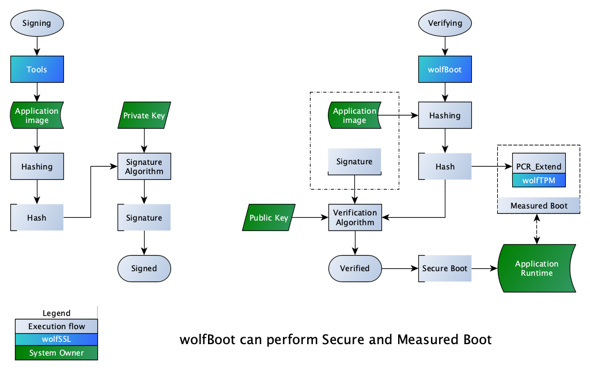

# STM32F407-Discovery-Measured-Boot

Measured Boot example running on STM32F407-Discovery board.

This project is meant to demonstrate Measured Boot using the [wolfBoot secure bootloader](https://github.com/wolfssl/wolfBoot), powered by wolfSSL.

The bootloader expects a Trusted Platform Module(TPM) to be available in hardware.

## Components
  - Bootloader: [wolfBoot](https://github.com/wolfssl/wolfBoot) by wolfSSL
  - Application: Test app printing the extended PCR value that wolfBoot created
  - TPM2.0 stack: [wolfTPM](https://github.com/wolfssl/wolfTPM) by wolfSSL

## Motivation

Measured Boot provides the application with a trace of the boot process. This trace(log) is resistant to spoofing and tampering.

This is achieved by using a TPM which has unique Platform Configuration Registers(PCR) to store hash measurements.

The application(runtime) then can use this tamper-proof log to determine whether the system is in a good known state (trustworthy) or if the system is infected with malware.

After a measurement is stored into one of the TPM's PCRs, the user could perform local attestation using a TPM2.0 Quote and report the log to a remote sever for evaluation:
   - The remote server can compare the log to golden value(s) and alert system owners in case of mismatch.
   - The remote server can directly take action with the device.

The following diagram is a big picture overview of the different guarantee Secure and Measured Boot provide:



## Details

Secure Boot is a way for the system owner to guarantee that the device started with a geniune software. However, this information is not available to the system later on. Therefore, the application runtime must assume any and all software that was run before it is geniune. Measured Boot eliminates the guessing element and provides a way for the application to know the state of the system before it took control.

Measured Boot could evaluate a single component like firmware or application image, or can evaluate multiple components like system settings and user configuration. Additionally, the golden value could be stored within the system for the application to self-evaluate its state without the need of a remote server.

This example performs measured boot, stores the measurement of the firmware image into PCR16 and then boots into a test application. The test application prints the result of the measured boot(the value of the PCR).

This example could be extended to support multiple measurements.

## Prerequisites

- `STM32F4-Discovery` board (STM32F407)
with
- `LetsTrust TPM2.0` module or `Infineon SLB9670` module

Hardware connections must be made between the TPM2.0 module and the STM32F4 board. Here is a wiring table for the Infineon module:

| STM32F4  | Pin function  | TPM2.0 module |
|----------|:-------------:|--------------:|
| PE0      | SPI CS        | Pin 26        |
| PB3      | SPI CLK       | Pin 23        |
| PB4      | SPI MISO      | Pin 21        |
| PB5      | SPI MOSI      | Pin 19        |
| 3V       | +3V           | Pin 1         |
| GND      | Ground        | Pin 6         |


UART1 on the STM32F4 is used by default. The default baud rate is 115200. 

The UART Pinout can be found below:

| STM32F4  | Pin function |
|----------|:------------:|
| PB6      | UART TX      |
| PB7      | UART RX      |
| GND      | Ground       |

Note: The ST-Link USB UDC is UART 2 on PA3 (TX) / PA2 (RX). This can be changed in app_stm32f4.c using APP_UART.

Note: Make sure the Ground connection between your USB-UART converter is connected to the STM32F4 board, otherwise UART levels will float and communication will be corrupted.


## Compiling

Before compiling make sure the git submodules are initialized and updated correctly. Use the following commands to make sure:

`wolfboot-examples/$ git submodule --init --update`

`wolfboot-examples/$ cd wolfBoot`

`wolfboot-examples/wolfBoot$ git submodule --init --update`

Enter the project folder for this example:

`wolfboot-examples/wolfBoot$ cd ../test-app-STM32F4-measured-boot`

Makefile in the project folder takes care of compiling wolfTPM, wolfBoot, compiling the test application and signing the firmware:

`wolfboot-examples/wolfBoot$ make`

The following files will be available in the project folder after successful build:

- factory.bin - Test-app and wolfboot combined, ready for flashing
- wolfboot.elf - WolfBoot with Debug information, useful for gdb
- image.bin - Test-app without signature
- image.elf - Test-app with Debug information, useful for gdb
- image_v1_signed.bin - Test-app with signature
- image.map - Listing of the Test-app

## Usage

After successful compilation, the `flash` target can be used to flash the `factory.bin` image to the STM32F4-Discovery board using ST-Link2

`make flash`

Typical output:

```
test-app-STM32F4-measured-boot % make flash
st-flash write factory.bin 0x08000000
st-flash 1.6.1
2021-01-27T19:24:01 INFO common.c: F4xx: 192 KiB SRAM, 1024 KiB flash in at least 16 KiB pages.
file factory.bin md5 checksum: 7cc2a98a3e5366ecc54bbb79a646286, stlink checksum: 0x01c745fb
2021-01-27T19:24:01 INFO common.c: Attempting to write 143576 (0x230d8) bytes to stm32 address: 134217728 (0x8000000)
EraseFlash - Sector:0x0 Size:0x4000 2021-01-27T19:24:01 INFO common.c: Flash page at addr: 0x08000000 erased
EraseFlash - Sector:0x1 Size:0x4000 2021-01-27T19:24:02 INFO common.c: Flash page at addr: 0x08004000 erased
EraseFlash - Sector:0x2 Size:0x4000 2021-01-27T19:24:02 INFO common.c: Flash page at addr: 0x08008000 erased
EraseFlash - Sector:0x3 Size:0x4000 2021-01-27T19:24:02 INFO common.c: Flash page at addr: 0x0800c000 erased
EraseFlash - Sector:0x4 Size:0x10000 2021-01-27T19:24:03 INFO common.c: Flash page at addr: 0x08010000 erased
EraseFlash - Sector:0x5 Size:0x20000 2021-01-27T19:24:05 INFO common.c: Flash page at addr: 0x08020000 erased
2021-01-27T19:24:05 INFO common.c: Finished erasing 6 pages of 131072 (0x20000) bytes
2021-01-27T19:24:05 INFO common.c: Starting Flash write for F2/F4/L4
2021-01-27T19:24:05 INFO flash_loader.c: Successfully loaded flash loader in sram
enabling 32-bit flash writes
size: 32768
size: 32768
size: 32768
size: 32768
size: 12504
2021-01-27T19:24:07 INFO common.c: Starting verification of write complete
2021-01-27T19:24:08 INFO common.c: Flash written and verified! jolly good!
```

To debug start first start GDB server (see GDB Server section below).

1. Launch arm-none-eabi-gdb and perform the following steps for debugging

2. Load symbol file for test application. Wolfboot.elf is already loaded thanks to .gdbinit supplied with the project.

`add-symbol-file image.elf`

3. Set breakpoints at "main", two breakpoints should be created, one for main() in wolfBoot and one for main() in the test app.

`b main`

4. Set breakpoints at "measure_boot", "read_measured_boot"

`b measure_boot`
`b read_measured_boot`

5. Start execution by invoking "continue" to gdb

`c`

6. Expected output on the connected UART terminal (see UART pinout in `Prerequisites`)

```
App started
Measured Boot PCR is = 0x01020304050607080910
```

This value is the one created by wolfBoot during start of the device. This value is the result of PCR Extend operation and depends on the firmware image loaded. Using the same firmware image should produce the same PCR measurement. By using different firmware images a change in the PCR value can be obsereved, simulating tampering.

For more information about measured boot contact us at facts@wolfssl.com

## GDB Server

The supplied openocd.config is prepared for STM32F407-Discovery revision D that uses newer ST-LINK2 variant.

If you are using STM32F407-Discovery revision B, then modify the very first line in the config file:

`source [find interface/stlink-v2-1.cfg]`

with

`source [find interface/stlink-v2.cfg]`

Start new openocd session using

`openocd -f openocd.config`

Start new gdb session as described in `Usage`.

Note: You can also use the ST-Util for GDB server using: `st-util -p 3333`.

Please contact us at support@wolfssl.com for any questions about using this example.

## Copyright notice

This example is Copyright (c) 2020 wolfSSL Inc., and distributed under the term of GNU GPL2.

wolfBoot, wolfSSL (formerly known as CyaSSL) and wolfCrypt are Copyright (c) 2006-2018 wolfSSL Inc., and licensed for use under GPLv2.

wolfTPM is Copyright (c) 2018-2020 wolfSSL Inc., and licensed for use under GPLv2.

See the documentation within each component subdirectory for more information about using and distributing this software.
