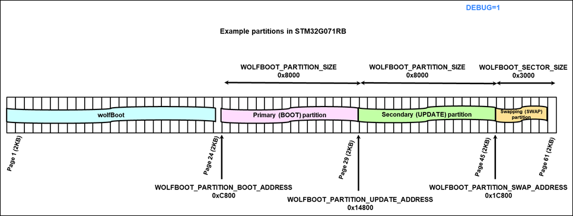

# [wolfBoot] porting to STM32G071

Preliminary porting for STM32G0.

## Attached zip file includes:
- hal
	- stm32g0.c / stm32g0.ld
		- porting adapted to G0 flash and clock implementation
- include
	- target_g0.h
		- To be renamed as target.h
- test-app
	- ARM_g0. Ld
		- To be renamed to ARM.ld
	- led.c
		- Including stm32g0 code
	- stm32g0.c
	- system.c
 
## wolfboot parent

- SHA-1: 11dd4f184e6407440f128c5aa308be456a1bd3b7
 
## Flash configuration

- Note: this is a preliminary layout... can be optimized.
 
## Compilation steps:

- Rename target_g0.h  >  target.h
- Rename ARM_g0.ld > ARM.ld
- `make SIGN=ECC256 TARGET=stm32g0 CORTEX_M0=1 DEBUG=1`
 
Tested test-app signature verification successfully. Firmware update has not been tested.
